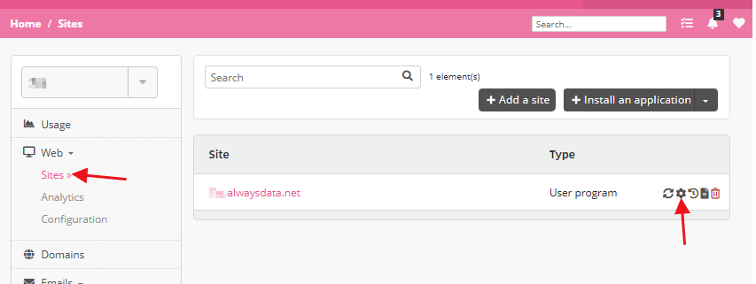
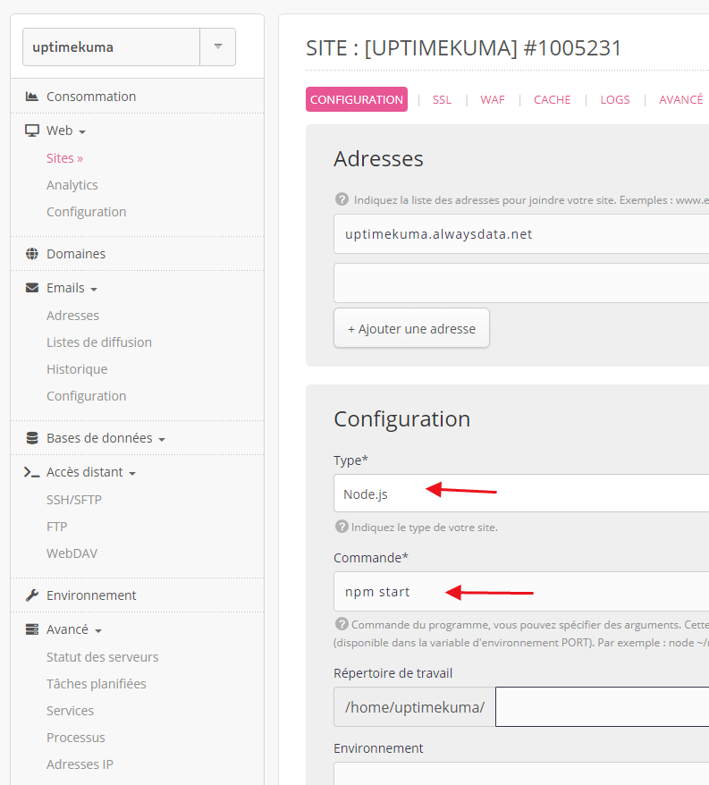
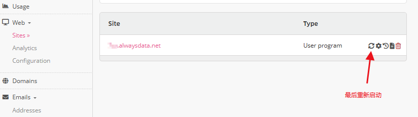

# 白虎面板 AlwaysData 一键安装脚本

> ⭐ **如果对你有帮助，欢迎点个 Star 支持一下！**
> 👉 注册地址：[https://admin.alwaysdata.com/](https://admin.alwaysdata.com/)

一键在 **AlwaysData 免费主机** 部署白虎面板，自动完成下载、配置并获取初始密码，适合快速搭建轻量级管理面板。

---

## ✨ 项目特性

* 🚀 一键安装，无需手动编译
* 🔐 自动获取默认管理员密码
* 📦 内置 SQLite，开箱即用
* 🧹 自动清理旧进程，避免冲突
* 📝 自动生成配置文件
* 💡 完全适配 AlwaysData 环境

---

## 📦 安装方式

进入 SSH 后执行以下命令：

```bash
bash <(curl -sL https://raw.githubusercontent.com/oyz8/AlwaysData-baihu/main/baihu-install.sh)
```

---

## 🎬 SSH 教程视频

👉 点击观看（从关键步骤开始）：
[https://youtu.be/uUdm1CuWOcM?t=126](https://youtu.be/uUdm1CuWOcM?t=126)

> 💡 如果你不会连接 SSH，强烈建议先看这个视频

---

## 📁 安装目录说明

默认安装路径：

```
~/www
```

目录结构：

```
www/
├── baihu              # 主程序
├── configs/
│   └── config.ini     # 配置文件
├── logs/
│   └── baihu-init.log # 启动日志
```

---

## 🔑 默认登录信息

安装完成后终端会显示：

```
用户名: admin
密码:   自动生成（脚本输出）
```

### ❗ 未获取到密码？

执行：

```bash
tail ~/www/logs/baihu-init.log
```

---

## ⚙️ AlwaysData 后台配置

安装完成后，需要在 AlwaysData 控制台设置运行方式：

### 操作步骤

1. 打开控制台
   👉 [https://admin.alwaysdata.com/site/](https://admin.alwaysdata.com/site/)

2. 进入：

```
Sites → 选择站点 → Modify
```



3. 修改为：

```
Configuration:     User program
Command:           ./baihu server
Working directory: /home/你的用户名/www
```



4. 保存并重启：

```
Submit → Restart
```



---

## 🌐 面板访问地址

```
https://你的用户名.alwaysdata.net
```

---

## ❗ 常见问题

### 1️⃣ 无法访问面板

* 确认已点击 **Restart**
* 检查配置是否正确
* 等待 1~2 分钟生效

---

### 2️⃣ 获取不到默认密码

```bash
cat ~/www/logs/baihu-init.log
```

---

## ⭐ 支持项目

如果这个项目对你有帮助：

👉 点个 **Star ⭐** 就是最大的支持！

---

## ⚖️ 免责声明

本项目仅供学习与研究使用。
使用本脚本产生的任何后果由使用者自行承担，请遵守 AlwaysData 的相关服务条款。

---
